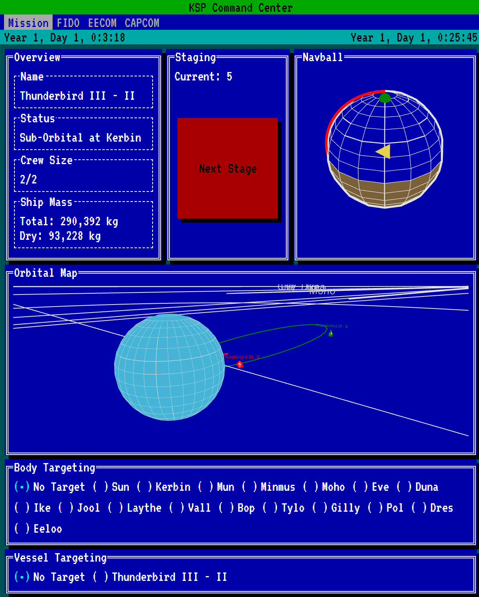
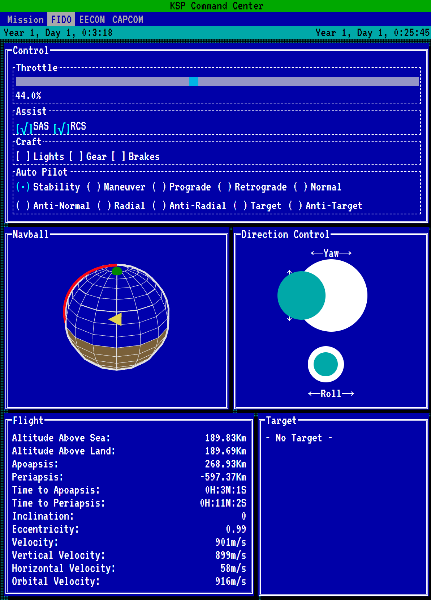
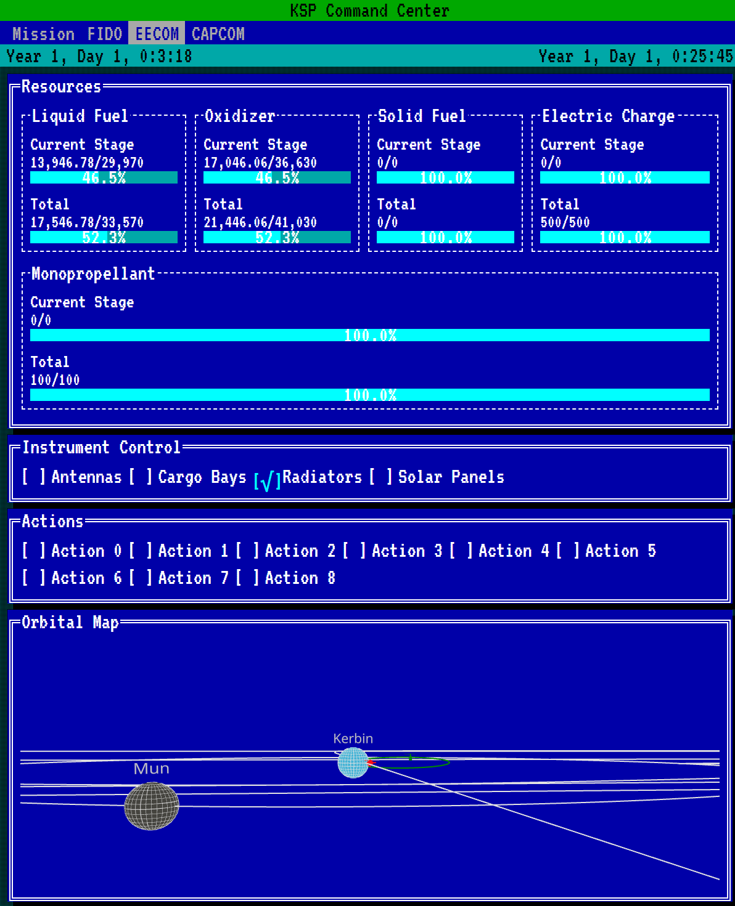
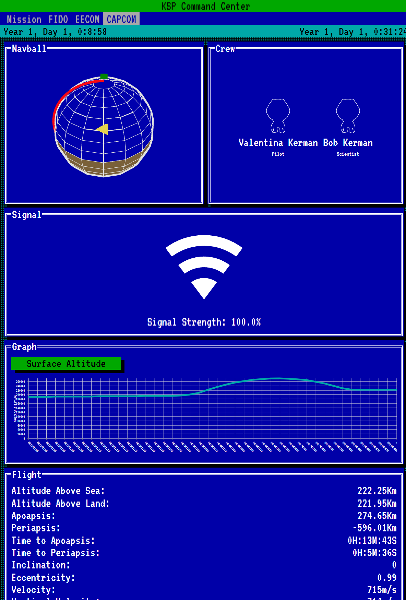

# KSP Command Center

This is the Kerbal Space Program Command Center, an application that uses [KRPC](https://github.com/krpc/krpc) to
provide a mission control interface to use with Kerbal Space Program.

You can use this in a similar way to Telemachus or Houston, with an astronaut playing KSP, and other people acting
as mission control.

## Screenshots

